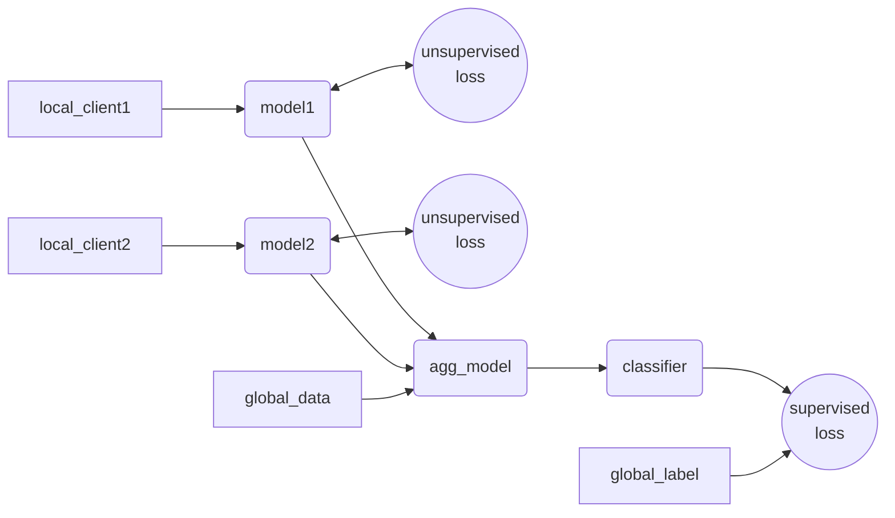

# financial_fraud
## dataset
1. 数据集A
2. 数据集B
3. C
## function
* k-mean
* LR1(emb+agg)
* Fedonce(修改版)
## kmeans
最后的准确率判断采取直接使用较高一方的结果。（因为事实上没进行分类）

## LR1(emb+agg)

```mermaid
    flowchart LR
      A1["global_data"]
      B(("fea<br>embedding"))
      B1(("fea<br>embedding"))
      C(("gobal<br>Classifier"))
      C1(("gobal<br>Classifier"))
      D1["global_label"]
      F("pre_train<br>loss")
      T1["train_data"]
      T2["train_data_perturb"]
      T11["train_data_predict"]
      T21["train_data_perturb_predict"]
      G1["global_data"]
      G2["global_data_perturb"]
      G11["global_label"]
      G21["global_data_perturb_predict"]
      GB3(("fea<br>embedding"))
      T3("unsupervised<br>loss")
      T31("supervised<br>loss")
      T4("total_loss")
      classDef end1 fill:#4B65AF,stroke:#666,stroke-width:2px,color:#fffff1
      class T4,F,T3,T31 end1;
      classDef back fill:#111111
      class ide1 back;
      subgraph ide0[pre_train]
      direction LR
      A1--->|split|B1
      B1--->C1
      C1-->|loss|F
      D1-->|loss|F
      F-->|update|C1
      F---->|update|B1
      end
      subgraph ide1[global/local_train]
      direction LR
      T1--->|noise|T2 
      T1-->B
      T2-->B
      B-->C
      C-->T11-->T3
      C-->T21-->T3
      T3-->|λ|T4
      end
      subgraph ide1[global/local_train]
      direction LR
      G1-->|noise|G2
      G2-->GB3
      GB3-->C
      GB3<-->|Synchronize<br>alternating update|B
      G11-->T31
      C-->G21-->T31
      T31-->T4
      end
      
```
### Fedonce

```mermaid
    flowchart LR
    A1["local_client1"]
    A2["local_client2"]
    B1("model1")
    B2("model2")
    B["global_data"]
    C1(("unsupervised<br>loss"))
    C2(("unsupervised<br>loss"))
    E1("agg_model")
    E2("classifier")
    F1["global_label"]
    F2(("supervised<br>loss"))
    A1-->B1<-->C1
    A2-->B2<-->C2
    B1-->E1
    B2-->E1
    B-->E1
    E1-->E2-->F2
    F1-->F2
    
```

