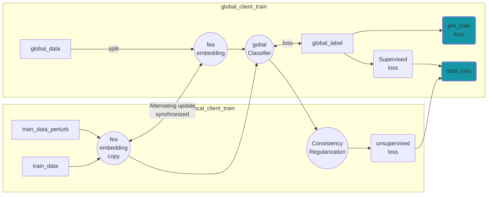

# financial_fraud
## dataset
1. 数据集A
2. 数据集B
3. C
## function
* k-mean
* 一个变形的linear
* 不知道
## kmeans
最后的准确率判断采取直接使用较高一方的结果。（因为事实上没进行分类）

## emb+agg

```mermaid
    flowchart LR
      A["global_data"]
      B(("fea<br>embedding"))
      C(("gobal<br>Classifier"))
      D["global_label"]
      E("Supervised<br>loss")
      F("pre_train<br>loss")
      T1["train_data"]
      T2["train_data_perturb"]
      T3("unsupervised<br>loss")
      T4("total_loss")
      ML2(("Consistency<br>Regularization"))
      ML3(("fea<br>embedding<br>copy"))
      style T4 fill:#1597A5,stroke:##FFF4DE,stroke-width:2px
      style F fill:#1597A5,stroke:##FFF4DE,stroke-width:2px
      subgraph ide1[global_client_train]
      direction LR
        A--->|split|B
        C<-->|loss|D
%%        D-->|update|C
%%        D-->|update|B
        B-->C
        D--->F
        D-->E
        E-->T4
        
      end
      subgraph ide2[local_client_train]
      direction LR
      T2-->ML3
      T1-->ML3
      C-->ML2
      ML3-->C
      ML3<-->|Alternating update<br>synchronized|B
      ML2-->T3
      T3-->T4
      end
```
